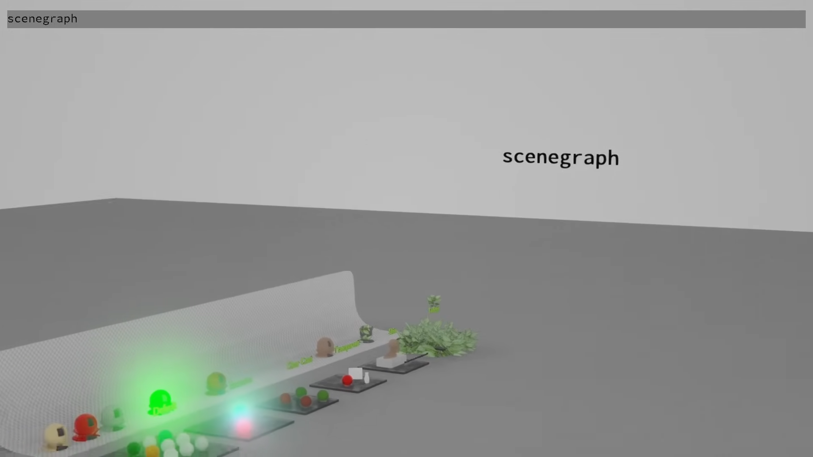
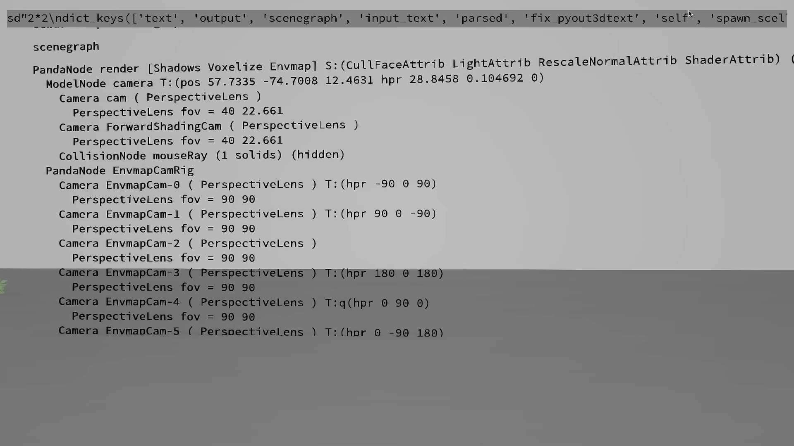
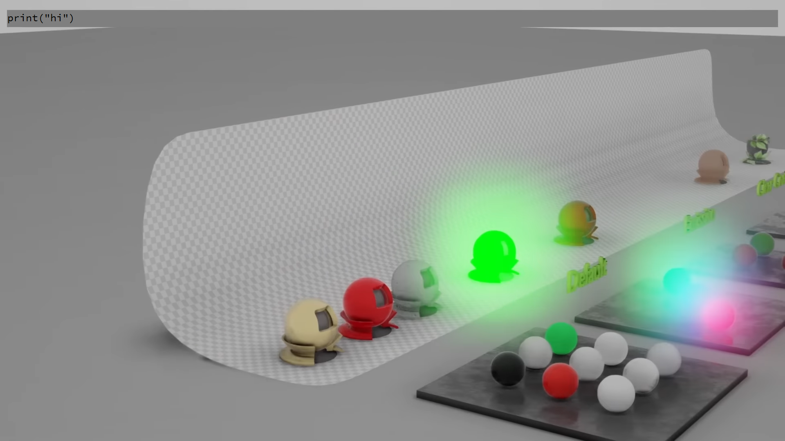
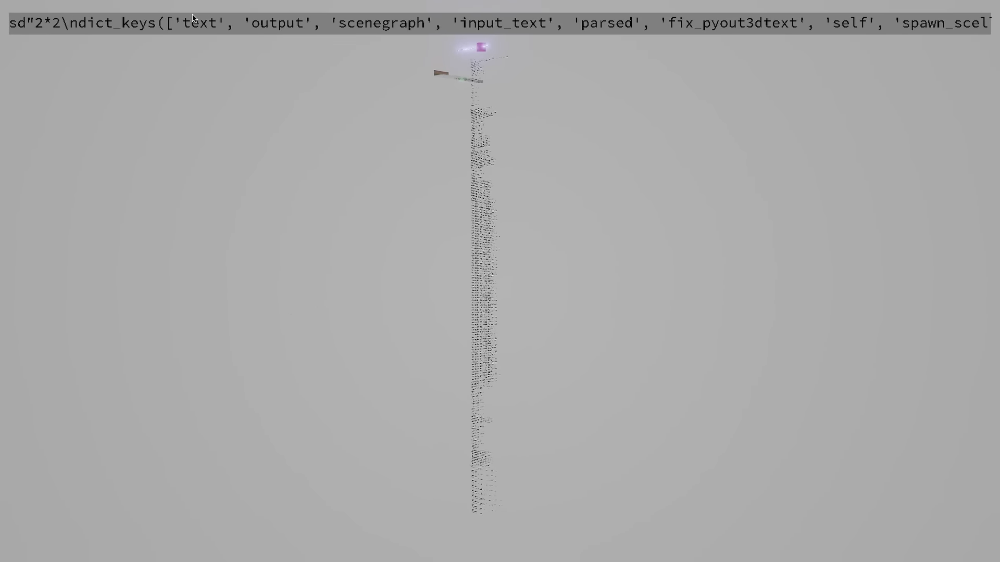

# Starcel-Python
A 3D Multiplayer Python IDE and Desktop Environment







### Included Python Libraries
panda3d, [renderpipeline](https://github.com/tobspr/RenderPipeline),\
black -> isort -> ssort -> ruff -> pyright-> pytest\
fast-autocomplete, rapidfuzz,\
xarray, numpy, pandas, h5py, pytensor, cupy(awaiting update), cupy_xarray(awaiting update),\
scipy, opencv, scikit-learn, sympy, mpmath, sagemath-standard, pymc, py4j, garamon\
astropy, pint, unyt, softposit, pendulum, more-itertools, plumbum, cmdix, dill, limeade, hy,\
fastapi, uvicorn[standard],\
datashader, bokeh, matplotlib, seaborn

### Included CLI Tools
* Everything and ES CLI for quickly searching the Windows file system
* FFmpeg for editing audio and video
* dlp for downloading videos
* WinPython: Not intended for use with StarcelPy - IDLE, IPython QT Console, Jupyter, Pyzo, QT, Spyder, VS Code

### How to run
Run the program by executing ```python render_pipeline\Starcel\server.py``` and ```python render_pipeline\Starcel\client.py``` you can run as many clients as you want, but full replication of those clients and a full compiled release is currently a WIP. 

### Notes
To change the background image or loading screen edit data/builtin_models/skybox/skybox.jpg and data/gui/loading_screen_bg.png. After editing, run render_pipeline\data\generate_txo_files.py. 
Using the project Ursina would have been useful for the extra functions, improved readability, and new networking library, but I was unable to find a physically-based renderer that would consistently work with it and imported objects. \
Awaiting a working release of Astron for networking or equivalent. \
There is a bug I had to work around with the M_Relative that should be fixed in Panda3D 11.0. \
The releases section will eventually include Starcel packaged with WinPython. \
This repo is a fork of the RenderPipeline repo because the startup image and environment hdri cannot be changed at runtime. Otherwise you should be able to just copy the Starcel folder if you were planning on trying to build renderpipeline from scratch. I have included every existing usable sample I could find for Panda3D(1/1/2024) and renderpipeline. \
I have not spent the time to find the bounds of the simulation. I know we are much more limited than in the UE5 version of Starcel, so you may run into errors if you make your character too small, speed too high, etc. \
You should be able to launch a dedicated server and port forward Starcel in your router just as you would any other game.\
Most of the features you saw in the UE5 version of Starcel are possible in this version of Starcel. With time they will be implemented and improved.\
A major refactor is coming soon. I usually write a bunch of code until I get it into a state I consider working and then I prune away all the excess code I commented out during testing, I fix the variable names, and I refactor the code into proper files. \
This project is entirely open source, so maybe you'll get to the refactor before I do. \
Feel free to submit any pull request and I might adopt your changes. 

### TODO and Planned Features
*Most not listed here*
File browser to replace windows explorer and nautilis
Load desktop folder
I recommend using thonny as a starting point for IDE development, tkinter is native to python
implement multivariable replacement to quickly replace variable names in a function with a preset list of variables
As inspiration for spreadsheet and table development, recall the starting point of a 2d spreadsheet exists in a slice of the octant of a 3d spreadsheet class object
Add player alignment tools
Add node dragging and alignment tools 
Fix loading transparent models bug
Implement https://sceditor.recursion.is menus
Implement technical details from video
Fix wysiwyg text editing
Add everything search exe as a function and filter for apps and shortcuts
Build exe and test python runtime to reshell windows
Restructure and refactor code
Autoswap desktop background and startup image


### Other Installations
Panda3D can be installed from https://docs.panda3d.org/1.10/python/introduction/installation-windows and you may want to include a panda.pth file with the following text at the same level as python.exe if you plan on using an external python environment
```
C:\Panda3D-1.10.13-x64
C:\Panda3D-1.10.13-x64\bin
```

I am bootstrapping this program as an IDE with the PyCharm IDE. You can fix the syntax highlighting by modifying the builtins file bundled with PyCharm. 
<details>
  <summary>Something like this, </summary>
  <p>

```
from panda3d.core import NodePath, VirtualFileSystem
from direct.showbase.ShowBase import ShowBase
from direct.directnotify.DirectNotify import DirectNotify
from direct.showbase.Messenger import Messenger
from direct.task.Task import TaskManager
from direct.showbase.Loader import Loader
# There are some other builtins but their use is a lot more unusual so they aren't included here. 

base: ShowBase
messenger: Messenger
taskMgr: TaskManager
render: NodePath
camera: NodePath
render2d: NodePath
aspect2d: NodePath
hidden: NodePath
loader: Loader
vfs: VirtualFileSystem
```
copied into ``pycharm_Install_Path/plugins/python/helpers/typeshed/stdlib/builtins.pyi``. 